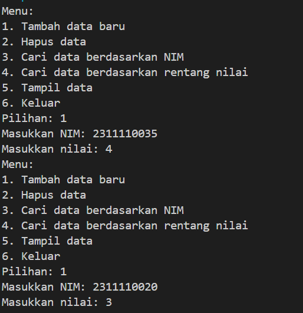
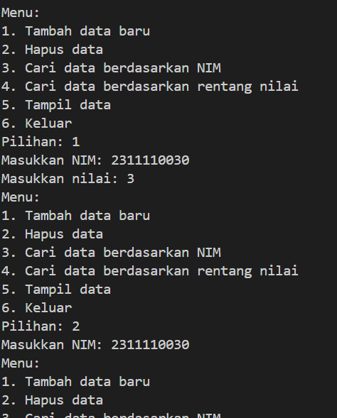

# LAPORAN PRAKTIKUM REKURSIF DAN HASH TABLE #
Maulisa Aurelia Putri

# Dasar Teori
# 1. Rekursif
Adalah suatu proses dari fugnsi yang memanggil dirinya sendiri. Dalam sebuah fungsi, rekursif pemanggilan dapat terjadi berulang kali. Karena proses tidak akan pernah berhenti sampai memori yang digunakan tidak dapat menampung lagi. Namun dalam pemecahannya, fungsi rekursif memerlukan memori yang lebih banyak untuk menyimpan activation record dan variabel lokal. Activation record diperlukan waktu proses kembali kepada pemanggil. Penyelesaian rekursif hanya digunakan jika penyelesaian sulit dilaksanakan secara iteratif, efisiensi dengan cara rekursif sudah memadai, dan efisiensi bukan masalah dibandingkan dengan kejelasan logika program. Terdapat dua jenis fungsi rekursif yaitu:
    a. rekursif langsung
    Fungsi memanggil dirinya sendiri secara langsung
    b. rekursif tidak langsung
    Fungsi memanggil dirinya sendiri secara tidak langsung dari fungsi lain

# 2. Hash Table

Adalah struktur data yang mengorganisir data kedalam pasangan kunci-nilai. Hash-table biasanya terdiri dari dua komponen utama yaitu array dan hash. Hash table bekerja dengan cara mengambil input kunci dan memetakannya ke nilai indeks array menggunakan fungsi hash. Kemudian data disimpan pada posisi indeks array yang dihasilkan digunakan untuk mencari data. Adapun operasi hash table yaitu:

    a. insertion = memasukkan data baru ke dalam hash table dengan menanggil fungsi hash untuk menentukan posisi bucket yang tepat dan menambahkan data ke bucket tersebut. 
    b. deletion = menghapus data dari hash table dengan mencari data menggunakan fungsi hash dan menghapusnya dari bucket yang sesuai
    c. searching = mencari data dengan mmenginput kunci ke fungsi hash untuk menentukan posisi bucket dan mencari data di dalam bucket yang sesuai 
    d. update = memperbarui data dengan mencari data menggunakan fungsi hash dan memperbarui data yang ditemukan
    e. Traversal = melalui seluruh hash table untuk memproses semua data yang ada dalam tabel. 
Adapun teknik dalam Hash table, yaitu:
    
    a. Open Hashing(chaining) = mengatasi chollision dengan cara menyimpan semua item data dengan nilai indeks yang sama. Setiap node merepresentasikan satu item data.
    b. Closed Hasing = terdiri dari linear probing, quadratic probing, dan double hashing. Ketia tejadi collision, linear probing akan mencari posisi yang kososng dibawah tempat terjadinya collision, jika tidak ada tempat kosong berarti has table sudah penuh. Pada penanganan quadratic probing sama dengan metode linear, hanya lompatannya tidak satu-satu, tetapi quadratic (12, 22, 32, 42, ...). Pada saat double hashing terjadi collision, terdapat fungsi hash yang kedua untuk menentukan posisinya kembali

# GUIDED
# 1. Rekursif langsung (direct recurtion)

#include <iostream>
using namespace std;

//kode ini berfungsi untuk melakukan hitung mundur dari angka yang diinputkan
void countdown (int n) {
    if (n == 0) {
        return 0;
    }
    cout << n << " ";
    countdown (n - 1);
}

int main() {
    cout << "rekursif langsung: ";
    countdown(5);  //5 merupakan inputnya
    cout << endl;
    return 0;
}

Program ini menggunakan teknik rekursif untuk melakukan hitung mundur dari angka yangi diinputkan. Pada fungsi `countdown` menerima parameter `n` yang merupakan angka yang akan dihitung mundur. Jika `n` tidak sama dengan 0, maka fungsi akan mencetak nilai `n` ke layar diikuti oleh spasi. Kemudain fungsi `countdown` memanggil dirinya sendiri dengan parameter `n - 1` yang berarti menghitung mundur dari `n` ke `n - 1`. Proses ini akan berulang sampai `n` sama dengan 0.

# 2. Rekursif Tidak Langsung (indirect recurtion)

#include <iostream>
using namespace std;

void functionB(int n);

void functionA() {
    if (n > 0) {
        cout << n << " ";
        functionB(n - 1);  //pannggilan rekursif tidak langsung
    }
}

void functionB(int n) {
    if (int n > 0) {
        cout << n << " ";
        functionA(n / 2); //panggilan rekursif tidak langsung
    }
}

Dari program ini, `functionA` memanggil fungsi `functionB` dan fungsi `functionB` memanggil fungsi `functionA`. Kedua fungsi tersebut memiliki para meter `n` dan mereka memanggil satu sama lain secara rekursif tidak langsung. Output program ini akan bergantung pada nilai awal yang diberikan kepada fungsi `functionA`, tetapi program ini juga akan mecetak nilai-nilai yang dihitung mundur dari nilai awal tersebut. 

# 3. Hash table 

#include <iostream>
#include <string>
#include <vector>

using namespace std;
const int TABLE_SIZE = 11;

string name;
string phone_number;
class HashNode {
public:
    string name;
    string phone_number;

    HashNode(string name, string phone_number) {
        this -> name = name;
        this -> phone_number = phone_number;
    }
};

class HashMap {
private:
    vector<HashNode*> table[TABLE_SIZE];
public:
    int hashFunc(string key) {
        int hash_val = 0;
        for (char c : key) {
            hash_val += c;
        }
    return hash_val % TABLE_SIZE; // 4 = 204, 12004, 6 = 266, 300    
    }
    void insert(string name, string phone_number) {
        int hash_val = hashFunc(name);

        for (auto node : table[hash_val]) {
            if (node -> name == name) {
                node -> phone_number = phone_number;
                return;
            }
        }
        table[hash_val].push_back(new HashNode(name, phone_number));
    }
    void remove(string name) {
        int hash_val = hashFunc(name);
        for (auto it = table[hash_val].begin(); it != table[hash_val].end(); it++) {
            if ((*it) -> name == name) {
                table[hash_val].erase(it);
                return;
            }
        }
    }
    string searchByName(string name) {
        int hash_val = hashFunc(name);
        for (auto node : table[hash_val]) {
            if (node -> name == name) {
                return node -> phone_number;
            }
        }
        return " ";
    }
    void print() {
        for (int i = 0; i < TABLE_SIZE; i++) {
            cout << i << ": ";
            for (auto pair : table[i]) {
                if(pair != nullptr) {
                    cout << "[" << pair -> name << ", " << pair -> phone_number << "]";
                }
            }
            cout << endl;
        }
    }     
};

int main() {
HashMap employee_map;

employee_map.insert("Mistah", "1234");
employee_map.insert("Pastah", "5678");
employee_map.insert("Gana", "91011");

cout << "nomor hp Mistah: " << employee_map.searchByName("Mistah") << endl;
cout << "nomor ho Pastah: " << employee_map.searchByName("Pastah") << endl;
cout << "nomor hp Gana: " << employee_map.searchByName("Gana") << endl;

employee_map.remove("Mistah");
cout << "nomor hp mistah setelah dihapus: " << employee_map.searchByName("Mistah") << endl << endl;
cout << "Hash table: " << endl;

employee_map.print();

return 0;
}

Program yang mengimplementasikan simple hash table yang menggunakan rantai yang terpisah. Pada AshNode class merepresentasikan data entri tunggal dalam hash table dengan atribut `nama` dan `phone_number`. Pada HashMap merepresentasikan hash table itu sendiri dengan ukuran yang ditentukan `TABLE_SIZE`. Dibagian `hashFunc` digunakan untuk menghitung nilai hash dari kunci yang diberikan (string) menggunakan pendekatan penjumlahan karakter sederhana dan mengembalikan nilai hash `Table_size`. Dibagian `searchByName` digunakan untuk mencari entri dengan nama yang diberikan dan mengembalikan `phone_number` yang terkait atau string kosong jika tidak ditemukan. Kemudian program utama akan membuat instance dari HashMap class, emplyee_map dan menyisipkan beberapa entri ke dalam hash table menggunakan `insert`. Menghapus entri menggunakan `remove` dan mencarinya lagi untuk menunjukkan bahwa entri data tersebut telah dihapus dan terakhir mencetak hash table dengan `print`.

# UNGUIDED
# 1. Buatlah sebuah program rekursif langsung (direct recursion) yang menghitung nilai faktorial dari sebuah inputan bilangan bulat positif!

#include <iostream>

using namespace std;

long long faktorial(int n) {
    if (n == 0) {
        return 1; // basis kasus: 0! = 1
    } else {
        return n * faktorial(n - 1); // rekursif langsung
    }
}

int main() {
    int input;
    cout << "Masukkan bilangan bulat positif: ";
    cin >> input;

    if (input < 0) {
        cout << "Input harus bilangan bulat positif!" << endl;
        return 1;
    }

    long long hasil = faktorial(input);
    cout << "Faktorial dari " << input << " adalah " << hasil << endl;

    return 0;
}

Program ini menggunakan fungsi `factorial` yang menghitung nilai faktorial dari sebuah bilangan bulat positif `n`. Fungsi ini menggunakan rekursif langsung dengan argumen `n - 1` sampai mencapai kasus `n == 0` dimana nilai faktorialnya adalah 1. sehingga dalam fungsi utama `main()` program ini meminta input dari user bilangan bulat positif kemudian memanggi fungsi `faktorial` dengan inputan tersebut.

# 2. Buatlah versi program rekursif tidak langsung (indirect recursion) dari soal nomor 1 diatas!

#include <iostream>
using namespace std;

long long helper(int n, int acc) {
    if (n == 0) {
        return acc; // basis kasus: 0! = acc
    } else {
        return helper(n - 1, n * acc); // rekursif tidak langsung
    }
}

long long faktorial(int n) {
    return helper(n, 1); // memanggil helper dengan acc = 1
}

int main() {
    int input;
    cout << "Masukkan bilangan bulat positif: ";
    cin >> input;

    if (input < 0) {
        cout << "Input harus bilangan bulat positif!" << endl;
        return 1;
    }

    long long hasil = faktorial(input);
    cout << "Faktorial dari " << input << " adalah " << hasil << endl;

    return 0;
}

secara umum, penggunaan `long` digunakan ketika program memerlukan ruang yang sangat besar. Tipe ini biasanya digunakan dalam aplikasi yang membutuhkan perhitungan yang tepat dengan angka yang besar. Selain itu, fungsi `helper` digunakan untuk menghitung nilai faktorial dari bilangan bulat positif `n` dan fungsi `faktorial` merupakan fungsi yang memanggil `helper` dengan `acc` berawalan 1. Dalam fungsi `helper` sendiri, penggunaan rekursif tidak langsung dengan argumen `n - 1` dan `n * acc` hingga mencapai `n == 0` dimana nilai faktorialnya adalah `acc`. 

# 3. Implementasikan hash table untuk menyimpan data mahasiswa. Setiap mahasiswa memiliki NIM dan nilai. Implementasikan fungsi untuk menambah data baru, menghapus data, mencari data berdasarkan NIM, dan mencari data berdasarkan nilai. Dengan ketentuan:
    a. setiap mahasiswa memiliki NIM dan nilai
    b. program memiliki tampilan pilihan menu berisi poin C
    c. Implementasikan fungsi untuk menambahkan data baru, menghapus data, mencari data berdasarkan NIM, dan mencari data berdasarkan rentang nilai (80 - 90)

#include <iostream>
#include <string>
#include <vector>
#include <list>
#include <functional>

using namespace std;

struct Mahasiswa {
    string NIM;
    int nilai;
};

class HashTable {
private:
    vector<list<Mahasiswa>> table;
    int size;

public:
    HashTable(int size) : size(size) {
        table.resize(size);
    }

    int hashFunction(string NIM) {
        int sum = 0;
        for (char c : NIM) {
            sum += c;
        }
        return sum % size;
    }

    void tambahData(Mahasiswa mahasiswa) {
        int index = hashFunction(mahasiswa.NIM);
        table[index].push_back(mahasiswa);
    }

    void hapusData(string NIM) {
        int index = hashFunction(NIM);
        for (auto it = table[index].begin(); it != table[index].end(); ++it) {
            if (it->NIM == NIM) {
                table[index].erase(it);
                return;
            }
        }
    }

    Mahasiswa* cariDataNIM(string NIM) {
        int index = hashFunction(NIM);
        for (auto& mahasiswa : table[index]) {
            if (mahasiswa.NIM == NIM) {
                return &mahasiswa;
            }
        }
        return nullptr;
    }

    vector<Mahasiswa> cariDataNilai(int min, int max) {
        vector<Mahasiswa> result;
        for (auto& bucket : table) {
            for (auto& mahasiswa : bucket) {
                if (mahasiswa.nilai >= min && mahasiswa.nilai <= max) {
                    result.push_back(mahasiswa);
                }
            }
        }
        return result;
    }

    void tampilData() {
        for (auto& bucket : table) {
            for (auto& mahasiswa : bucket) {
                cout << "NIM: " << mahasiswa.NIM << ", Nilai: " << mahasiswa.nilai << endl;
            }
        }
    }
};

int main() {
    HashTable hashTable(10);

    int pilihan;
    while (true) {
        cout << "Menu:" << endl;
        cout << "1. Tambah data baru" << endl;
        cout << "2. Hapus data" << endl;
        cout << "3. Cari data berdasarkan NIM" << endl;
        cout << "4. Cari data berdasarkan rentang nilai" << endl;
        cout << "5. Tampil data" << endl;
        cout << "6. Keluar" << endl;
        cout << "Pilihan: ";
        cin >> pilihan;

        switch (pilihan) {
            case 1: {
                Mahasiswa mahasiswa;
                cout << "Masukkan NIM: ";
                cin >> mahasiswa.NIM;
                cout << "Masukkan nilai: ";
                cin >> mahasiswa.nilai;
                hashTable.tambahData(mahasiswa);
                break;
            }
            case 2: {
                string NIM;
                cout << "Masukkan NIM: ";
                cin >> NIM;
                hashTable.hapusData(NIM);
                break;
            }
            case 3: {
                string NIM;
                cout << "Masukkan NIM: ";
                cin >> NIM;
                Mahasiswa* mahasiswa = hashTable.cariDataNIM(NIM);
                if (mahasiswa != nullptr) {
                    cout << "NIM: " << mahasiswa->NIM << ", Nilai: " << mahasiswa->nilai << endl;
                } else {
                    cout << "Data tidak ditemukan" << endl;
                }
                break;
            }
            case 4: {
                int min, max;
                cout << "Masukkan rentang nilai (min - max): ";
                cin >> min >> max;
                vector<Mahasiswa> result = hashTable.cariDataNilai(min, max);
                for (auto& mahasiswa : result) {
                    cout << "NIM: " << mahasiswa.NIM << ", Nilai: " << mahasiswa.nilai << endl;
                }
                break;
            }
            case 5: {
                hashTable.tampilData();
                break;
            }
            case 6: {
                return 0;
            }
            default: {
                cout << "Pilihan tidak valid" << endl;
            }
        }
    }

    return 0;
}

Output

Pada konstanta `maksimalQueue` digunakan untuk menentukan nilai maksimum antrian (5 dalam kode ini). `front` untuk menginisialisasi penanda pada posisi denpan antrian (0). `back` untuk emnginisialisasi penanda posisi belakang antrian (0). `queueTeller` untuk mendeklarasikan array string untuk menyimpan data antrian. Beberapa fungsi yang digunakan adalah:
    a. isFull() = untuk mengecek apakah antrian penuh (kembali true jika penuh dan false jika tidak)
    b. isEmpty() = untuk mengecek apakah antrian kososng (kembali true jika kosong, dan false jika tidak)
    c. enqueueAntrian() = untuk menambahkan data ke antrian kemudain memeriksa apakah antrian penuh. Jika kosong, data ditambahkan di elemen pertama. Jika tidak, data ditambahkan ke elemen terakhir
    d. dequeueAntrian() = menghapus data dari antrian pertama kemudain memeriksa apakah antrian kosong. JIka tidak kososng maka memindahkan semua elemen ke kiri satu posisi dan menurunkan nilai back
    e. countQueue() = menghitung jumlah elemen dalam antrian
    f. claerQueue() = untuk menghapus semua data 
Pada program utama `main()` akan menampilkan menu program kemudian membuat loop do-while untuk menjalankan program berulang kali dan meminta user untuk memilih opsi dari menu. Menggunakan switch-case untuk menjalankan fungsi sesuia pilihan seperti `enqueueAntrian`, `dequeueAntrian()`, `viewQueue`, `clearQueue` dan keluar dari program. setelah itu, loop kembali ke menu sampai user memilih pilihan 5.

# Referensi 
[1]Anggoro, D., & Sulawesi Barat, U. (2024). DASAR-DASAR PEMPROGRAMAN Sugiarto Cokrowibowo. https://www.researchgate.net/publication/379323458. [2]Hakim, L. (2017). OPERASI LOGIKA PADA GENERAL TREE MENGGUNAKAN FUNGSI REKURSIF Eko mulyanto Yuniarno Institut Teknologi Sepuluh Nopember. https://www.researchgate.net/publication/315726778. [3]Nasution, Y. R. (n.d.). MODUL STRUKTUR DATA PEMROGRAMAN C++. https://www.researchgate.net/publication/339068699. [4]modul rekursif dan hash table 